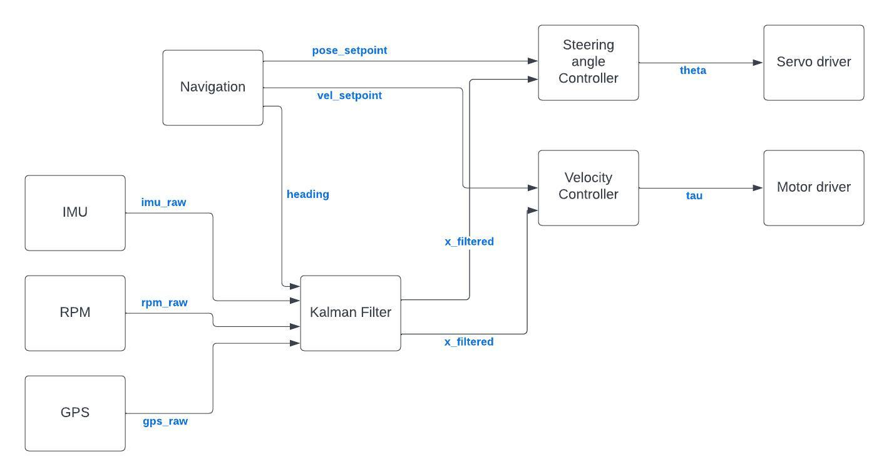

#admin 

Our design is broken into two key parts, physical design and performance design.

## Physical Design

Our physical design began with [[System Identification]], this process allowed us to better understand a lot of the constant components associated with the system such as weight of the car and its components, center of gravity, etc. 

From there, we went over the different [[Sensors & Electronics]] associated with the Picar, located their pinouts and determined their connections to the Pihat attachment, utilized with our Raspberry Pi. 

After getting the sensors wired up we started our [[PiTop Redesign]] to allow for our sensors and electronics to be properly mounted on the PiCar, in a way that is conducive to their performance and also with regard to the center of gravity of the car. 

## Performance Design

While physical design is extremely important, most of our project bandwidth went towards performance design, or in other words the modeling, filtering, and coding that goes into our PiCar being able to perform it's designated task at the end of the semester.

We began this process with [[PiCar Modelling and Simulation]], where we ulilized state space modeling and our previous system identification in order to model our PiCar in Matlab. 

After completing our model, we began getting basic code to run on each of our sensors ([[Sensor SetUp]]). Including trying to take notes on the different configuration specs when the sample code exposed the configuration ([[MPU6050 Configuration]]).

Running the sensor code exposed the need for [[Bus Communication Protocols]] knowledge. Specifically with utilizing [[I2C]], but also looking into [[CAN]] and [[SPI]].

Then we started on looking into the relevant filters for our Picar. Specifically, we hoped to have a [[Controller and Estimator Design]] for our Picar implementation in the form of a PID and Kalman Filter. We spent time not only with the theory and how it applied to our car, but in working out the math as it pertained to our model. Our overall ROS2 design can be visualized by the following block diagram:

We finally shifted our focus to [[Navigation Design]] as our final goal for our Picar is for it to be able to autonomously navigate a test course. In order to focus and test our design we began conducting [[Outdoor Testing]], this allows us to better see the successes and faults of our system at different points of time. The outdoor testing process is also critical for data collection and successfully filtering the data.
